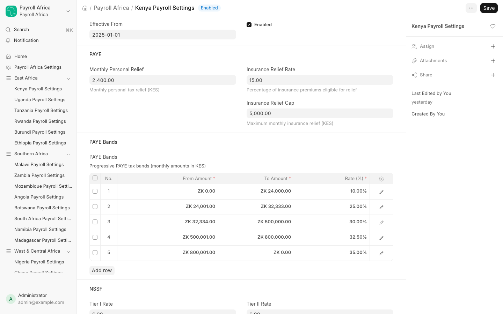

# Country Settings

Every enabled country has its own Settings page in the workspace sidebar (for example **Kenya Payroll Settings**). This is where you keep statutory rates and tax bands current — no code changes required.

## Common fields

Each country settings page includes:

- **Effective From** — the date the current rates took effect. Update it whenever you change rates, so the change is tracked.
- **Enabled** — disable a single country here without touching the global switch in Payroll Africa Settings.
- **Rate fields** — contribution percentages, ceilings, minimum wages, and reliefs specific to the country.
- **Tax band table** — the progressive tax brackets (from-amount, to-amount, rate). Edit brackets directly in the grid.

## Tax bands

Progressive taxes (PAYE, PIT, IRPP, etc.) are defined as bands in a child table. Each row has a lower bound, an upper bound, and a rate. Set the top band's upper bound to `0` to mean "and above".

For example, Kenya's PAYE bands and NSSF tiers, SHIF rate, Housing Levy, NITA, and personal relief are all editable on the Kenya Payroll Settings page.

## Examples of country-specific settings

| Country | Configurable fields |
|---------|---------------------|
| Kenya | NSSF Tier I/II rates and caps, SHIF rate, Housing Levy rates, NITA, personal relief, PAYE bands |
| South Africa | PAYE rebates, UIF rate and annual cap, SDL rate |
| Zimbabwe | PAYE bands (USD or ZiG), NSSA rate and annual ceiling, AIDS Levy rate, currency mode |
| Senegal | IPRES rates and ceiling, CSS Health rates, AMO Health toggle, income-tax bands, family deductions |
| Mauritius | NSF rate and ceiling, CSG rate, HRDC rate, PRGF toggle, Fair Share Contribution toggle |
| Cameroon | CNPS rates, family allowances, work-injury risk class, CFC housing, FNE rate, PIT abatement, CRTV bands, Taxe Communale bands |

## Fallback defaults

If a country's Settings page has not been customized, its calculator falls back to current statutory defaults, so payroll works correctly immediately after installation. Configure the page to override those defaults with your organization's exact figures.

## Next Steps

Continue to [Running Payroll](running-payroll.md).
