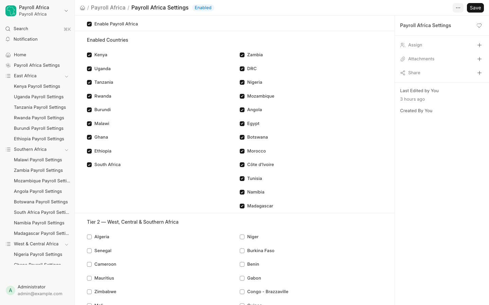

# Getting Started

Payroll Africa is controlled from a single page: **Payroll Africa Settings**. Here you switch the app on and choose which countries are active.

## Open Payroll Africa Settings

From the **Payroll Africa** workspace, click **Payroll Africa Settings** (under Global Settings), or search for it in the awesome bar.

## Automatic country detection

Payroll Africa can enable countries for you automatically, so you often don't need to tick them by hand:

- **On installation**, it scans your existing Companies and enables the country of each one — a Company based in Kenya enables Kenya, a Company in Nigeria enables Nigeria, and so on.
- **When you add a new Company**, its country is enabled automatically.

This is **additive only**: it never disables a country you have turned off, and it does not change your selections when you run `bench migrate`. In the screenshot above, the ticked countries under **Enabled Countries** reflect the companies configured on this site, plus any manual choices. You can always override the result in the next section.

## Enable the app

Tick **Enable Payroll Africa** at the top of the page. This is the master switch — when it is off, no statutory deductions are computed for any country.

## Enable countries

Under **Enabled Countries**, tick each country you operate payroll in. Countries are grouped by region and tier so you can find them quickly.

When a country is **enabled**:

- Its settings page and reports appear in the workspace sidebar.
- The engine computes its statutory deductions on matching employees' Salary Slips.
- Its salary components are available in Salary Structure dropdowns.

When a country is **disabled**:

- Its settings and report links disappear from the sidebar immediately — no restart required.
- The engine silently skips employees in that country.
- Its salary components are hidden from Salary Structure component dropdowns.

## Save

Click **Save**. Changes take effect on the next Salary Slip computation — there is nothing to migrate or restart.

## Next Steps

- Configure each active country's rates in [Country Settings](country-settings.md).
- Set up employees and run payroll in [Running Payroll](running-payroll.md).
