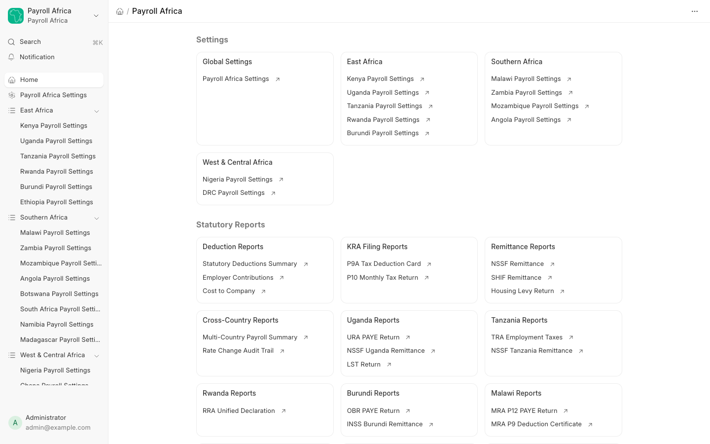

# Reports

Payroll Africa ships **111 reports** — country-specific statutory returns and remittances, plus cross-country summaries. All reports are available from the **Statutory Reports** section of the Payroll Africa workspace.

## Cross-country reports

| Report | Description |
|--------|-------------|
| Statutory Deductions Summary | All employee deductions by period, with dynamic columns per component |
| Employer Contributions | Employer-only statutory costs per employee |
| Cost to Company | Total compensation including all employer contributions |
| Multi-Country Payroll Summary | Consolidated view across all enabled countries |
| Rate Change Audit Trail | History of statutory rate changes with effective dates |

## Country reports

Each enabled country provides its own statutory returns and remittance reports. A few examples:

| Country | Reports |
|---------|---------|
| Kenya | P9A Tax Deduction Card, P10 Monthly Tax Return, NSSF Remittance, SHIF Remittance, Housing Levy Return |
| Uganda | URA PAYE Return, NSSF Uganda Remittance, LST Return |
| Nigeria | PAYE Schedule, PenCom Remittance, NHF Remittance, NHIS Schedule |
| Ghana | PAYE Schedule, SSNIT Remittance |
| South Africa | PAYE Remittance, UIF Remittance |
| Egypt | Income Tax Return, Social Insurance Remittance |

## Running a report

1. Open the report from the **Statutory Reports** section of the workspace, or search for it.
2. Set the filters — typically **Company** and a **date range** (and country, for cross-country reports).
3. The report renders once Salary Slips exist in the selected period. Export to Excel or CSV from the report menu.

## Next Steps

Continue to the [API Reference](api.md).
