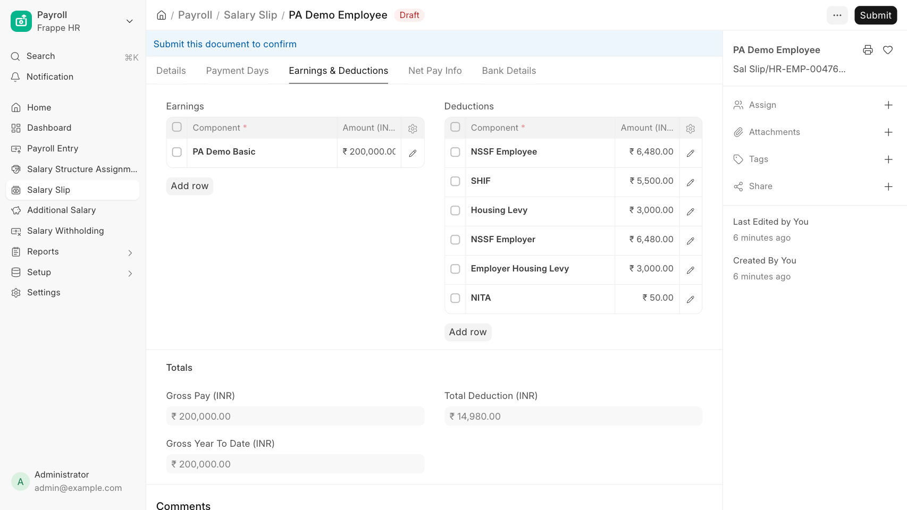

# Running Payroll

Once a country is enabled and configured, Payroll Africa computes its statutory deductions automatically whenever you create a Salary Slip for an employee in that country.

## How country is resolved

For each Salary Slip, the employee's payroll country is resolved in this order:

1. **Salary Structure Assignment** → `Payroll Country`
2. **Employee** → `Payroll Country`
3. **Company** → `Country`

Set the **Payroll Country** field on the Employee (or on the Salary Structure Assignment for date-effective changes). If it is not set, the engine falls back to the company's country.

## Set up an employee

1. Open the **Employee** record.
2. Set **Payroll Country** to the relevant country (e.g. Kenya).
3. Assign a **Salary Structure** — use the country's pre-built template (e.g. "Kenya Payroll Template") or your own.

You do not need to add statutory components manually; the calculator appends any missing ones during Salary Slip validation.

## Create a Salary Slip

Create and save a Salary Slip for the employee as usual. Payroll Africa runs during computation and populates:

- **Employee deductions** in the Salary Slip `Deductions` table.
- **Employer-only contributions** in the `Employer Contributions` table (when present).

The example below shows the same employee before and after Payroll Africa is active. With the app enabled, the Kenya statutory rows — NSSF Employee, SHIF, Housing Levy, NSSF Employer, Employer Housing Levy, and NITA — are appended automatically, and the totals update.

## Bulk recalculation

After changing rates, recompute existing **draft** Salary Slips without reopening each one:

- **One country:** `recalculate_salary_slips(country, from_date, to_date, company)`
- **All enabled countries:** `recalculate_all_countries(from_date, to_date)`

See the [API Reference](api.md) for details. Submitted slips are never modified.

## Next Steps

Continue to [Reports](reports.md).
